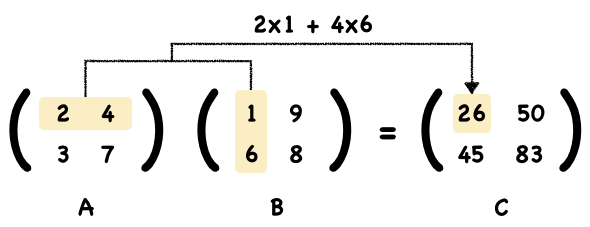
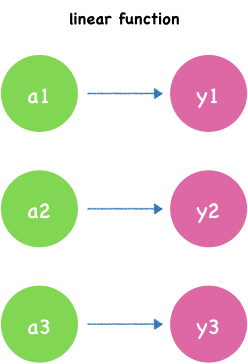
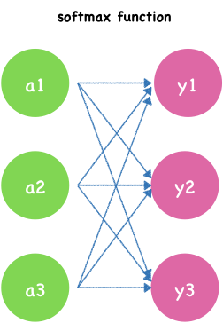

---
redirect_from:
  - "/03/forwardpropagation"
interact_link: content/03/ForwardPropagation.ipynb
kernel_name: python3
has_widgets: false
title: 'Forward Propagation'
prev_page:
  url: /03/MultilayerPerceptron
  title: 'Multilayer Perceptron'
next_page:
  url: /04/Intro
  title: '4. Training Neural Networks'
comment: "***PROGRAMMATICALLY GENERATED, DO NOT EDIT. SEE ORIGINAL FILES IN /content***"
---

# Forward Propagation

Now we get familiar with the deep feedforward networks's structure, we are going to learn how the single pass through the network.

There is a two-layer neural network with one hidden layer. Here the value of input $x_1$ and $x_2$ are:


{:.input_area}
```python
x1 = 0.2
x2 = 0.8
```


We start with some random weights and bias from between layer0 and layer1:


{:.input_area}
```python
# Layer 0 to Layer 1
b1 = 0.4
b2 = 0.56
b3 = 0.64

w11 =1.0
w12 = 0.7
w13 = 0.34
w21 = 0.5
w22 = 0.8
w23 = 0.6
```


This animation shows how the single pass through the network:


A hidden unit in hidden layer looks like this:


Here we use sigmod function as activate function h(x).


{:.input_area}
```python
import numpy as np
def sigmoid(x):
    return 1 / (1 + np.exp(-x))
```


The first layer of nodes is input layer which doing nothing but input signals. Notice that we add a bias node which weight is $b_1$.

Move to the second layer, let's calculate input of first node:

$$a_1 = w_{1,1}x_1+w_{2,1}x_2 + b_1$$

The input nodes have values of 0.2 and 0.8. The weight of bias node in input layer and the first node in hidden layer is 0.4. The weight from second node in input layer is 0.1. The link weight from third node is 0.5. So the combined $a_1$ input is:

$$a_1 = 1 * 0.2 + 0.5 * 0.8 + 0.4$$

$$a_1 = 0.2 + 0.4 + 0.4$$

$$a_1 =1$$


{:.input_area}
```python
a1 = w11 * x1 + w21 * x2 + b1
print(a1)
```


{:.output .output_stream}
```
1.0

```

Then we calculate the output of this node using activate function $h(x) = sigmod(x)$.

$$z_1 = sigmod(a_1)$$

$$ z_1 =  \frac{\mathrm{1} }{\mathrm{1} + e^{-1.1} }  $$

$$z_1 = 0.7310585786300049$$


{:.input_area}
```python
z1 = sigmoid(a1)
print(z1)
```


{:.output .output_stream}
```
0.7310585786300049

```

Cool! We have finished calculate the first node's output. 

The remaining two nodes can be calculated with the same way.

The second node of hidden layer:

$$a_2 = w_{1,2}x_1+w_{2,2}x_2 + b_2$$

$$a_2 = 0.7 * 0.2 + 0.8* 0.8 + 0.4 = 1.3400000000000003$$

$$z_2 = sigmod(a_2) = 0.7924899414403644$$


{:.input_area}
```python
a2 = w12 * x1 + w22 * x2 + b2
print(a2)
```


{:.output .output_stream}
```
1.3400000000000003

```


{:.input_area}
```python
z2 = sigmoid(a2)
print(z2)
```


{:.output .output_stream}
```
0.7924899414403644

```

The third node of hidden layer:

$$a_3 = w_{1,3}x_1+w_{2,3}x_2 + b_3$$

$$a_3 = 0.34 * 0.2 + 0.6 * 0.8 + 0.4 = 1.1880000000000002$$

$$z_3 = sigmod(a_3) = 0.7663831750110293$$


{:.input_area}
```python
a3 = w13 * x1 + w23 * x2 + b3
print(a3)
```


{:.output .output_stream}
```
1.1880000000000002

```


{:.input_area}
```python
z3 = sigmoid(a3)
print(z3)
```


{:.output .output_stream}
```
0.7663831750110293

```

For each node we need to write the corresponding calculation formula, now we just handwritten three nodes, you are likely to get the wrong index. In the future, our network will become more and more complex, and there may be hundreds or thousands of nodes. If we still use such a way, it would be difficult to ensure that nothing goes wrong, isn't it?

So how do we simplify this? Actually using the matrix in mathematics can simplify and speed up the node's calculation of the computer. Let's see what's going on.

## Matrix

In mathematics, a **matrix** (plural: **matrices**) is a table, a rectangular array of numbers, symbols, or expressions, arranged in rows and columns. In python, we can use two-dimensional array to represent it.

For example, the dimension of the matrix below is 2 by 3, because there are two rows and three columns:


In Python, we usually use Numpy to represent and evaluate matrices.


{:.input_area}
```python
A = np.array([[2,4,5],[3,7,9]])
```


We use ndim funcation to get the dimension of the matrix:


{:.input_area}
```python
np.ndim(A)
```


{:.output .output_data_text}
```
2
```


Shown as the ouput, this is a two dimension matrix.

And we can use shape function to get shape:


{:.input_area}
```python
A.shape
```


{:.output .output_data_text}
```
(2, 3)
```


This is a 2 by 3 array matrix. 2 represent the number of rows, which means the first dimension has 2 elements. 3 represent the number of columns, which means the second dimension has 3 elements.

### Multiplying Matrixs

Now let's see how to multiple Matrix. When multiply a matrix by another matrix we need to do the **dot product** of rows and columns. Here’s an example of two simple matrixs A and B multiplied together.

To work out the top left element of the answer, let's take the dot product of first row of A and first column of B.

The **Dot Product** means multiply matching members, then sum up:

$$(2, 4) • (4, 6) = 2×4 + 4×6 = 26$$

We multiply first numbers 2 and 4, likewise for the second numbers 4 and 6, and finally sum them up.




Using the same way, we figure out the top right element of the answer.


That's easy right? Continuing work out the rest numbers by yourself.


Finally, we get the result matrix C.

Notice that we can’t multiply any two matrices, they need to be compatible, which means the number of columns in the first must be equal to the number of rows in the second.

This operation can be achieved using Numpy. We create two matrix A and B:


{:.input_area}
```python
A = np.array([[2,4],[3,7]])
print(A)
```


{:.output .output_stream}
```
[[2 4]
 [3 7]]

```


{:.input_area}
```python
B = np.array([[1,9],[6,8]])
print(B)
```


{:.output .output_stream}
```
[[1 9]
 [6 8]]

```

Then use **dot** operation to multiply them and assign the result to matrix C:


{:.input_area}
```python
C = np.dot(A,B)
print(C)
```


{:.output .output_stream}
```
[[26 50]
 [45 83]]

```

## Apply matrix to neural network computation

Now that you understand the basics, let's see how we can apply matrix  to neural network computation.

Let's using the variables in our neural networks.

Before, the calculation formula we use is as follows:

$$a_1 = w_{1,1}x_1+w_{2,1}x_2 + b_1$$

$$a_2 = w_{1,2}x_1+w_{2,2}x_2 + b_2$$

$$a_3 = w_{1,3}x_1+w_{2,3}x_2 + b_3$$


Now, we use matrix to represent:


W is the matrix of weights, X is the matrix of inputs, B is the bias.

The formula for calculating the input of the hidden layer is as follows

$$A = XW + B$$


We use a simple matrix operation expression $A = XW + B$ to calculate the input of the hidden layer node. Even if we add more nodes, the formula will be the same. It's pretty neat and powerful.

Let's use Numpy for hidden layer node calculations.


{:.input_area}
```python
import numpy as np
X = np.array([x1, x2])
W = np.array([[w11, w12, w13], [w21, w22, w23]])
B = np.array([b1, b2, b3])
```


{:.input_area}
```python
A = np.dot(X,W) + B
print(A)
```


{:.output .output_stream}
```
[1.    1.34  1.188]

```


{:.input_area}
```python
Z = sigmoid(A)
print(Z)
```


{:.output .output_stream}
```
[0.73105858 0.79248994 0.76638318]

```

The calculation process looks a lot cleaner than it did before.

## Design the output layer

Applying the same signal calculation flow between input layer and hidden layer, we can calculate signal between hidden layer and output layer.

The node in output layer's structure is the same as the hidden layer's node. However, the choose of the activate function is different according to difference types of questions. 

In machine learning, there are two kind of kinds of problems: **regression** and **classification**. The output values of classification problem are **categorical data**. The Iris classification problem we mentioned earlier falls into this category. While the output values of regression problem are **numerical data**. For example, let's support that we're going to predict what's the probability of rain tomorrow. The probability can be 29%, 29.3%, 98% and so on. It is a numerical value, so it's a regression problem.

For the regression, We can use the **linear function**. The simple one is identity activation function.

$$ f(x) = x $$



For the classification, **softmax** function is a good choose. It squashes the outputs of each unit to be between 0 and 1, and the sum of outputs values is equal to 1. Mathematically the softmax function is shown below.

$$y_{k} = \frac{e^{a^{k}}}{\sum_{i=1}^{n}e^{a^{i}}}$$

$y_k$ is the $kth$ node's output. $n$ is the number of nodes in output layer. $k$ indexes the output units, so $k = 1, 2, ..., n$.

Implementation in Python:


{:.input_area}
```python
import numpy as np
def softmax(a):
    c = np.max(a)
    exp_a = np.exp(a - c) # avoid overflow
    sum_exp_a = np.sum(exp_a)
    y = exp_a / sum_exp_a
    return y
```




Suppose we want to predict tomorrow's weather, which has three kinds: sunny, cloudy and rainy. Using softmax as activate function, the final outputs will be the probability of these three categories. For the example image above, the output of the softmax function might look like:


{:.input_area}
```python
a = np.array([1.83,0.96,0.4])
y = softmax(a)
y
```


{:.output .output_data_text}
```
array([0.60304157, 0.2526452 , 0.14431323])
```


For tomorrow's weather, the probability of sunny day is 0.605, cloudy day is 0.153 and rainy day is 0.144. So we forecast tomorrow might be a sunny day.

## Summary

1. Forward propagation sequentially calculates the intermediate variables of neural network from input layer to output layer.
2. Using matrix dot product make the calculation much more neat and powerful.
3. When designing the output layer, different activation functions should be selected according to different problems.

- https://en.wikipedia.org/wiki/Matrix_(mathematics)
- https://www.mathsisfun.com/algebra/matrix-multiplying.html
