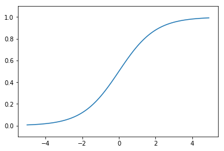

---
redirect_from:
  - "/03/multilayerperceptron"
interact_link: content/03/MultilayerPerceptron.ipynb
kernel_name: python3
has_widgets: false
title: '3. Multilayer Perceptron'
prev_page:
  url: /02/Iris
  title: 'Iris Classification'
next_page:
  url: /03/MultilayerPerceptron
  title: 'Multilayer Perceptron'
comment: "***PROGRAMMATICALLY GENERATED, DO NOT EDIT. SEE ORIGINAL FILES IN /content***"
---

# Multilayer Perceptron [Draft]

Abstract

In this chapter, we will ... balabala

## Multi Output Perceptron

In last chapter, we learn about the single output perceptron. If we conbine two or more perceptron, we can get a multi output perceptron.


## Multilayer perceptron

Multilayer perceptron, also named deep feedforward networks. It adds hidden layers to the previous perceptron.

The diagram 3.1 shows an example neural network. To keep the diagram clear, all the weights are unmarked. The leftmost layer 0 is the **input layer**. The right most layer 2 is the **ouput layer**. The middle layer 1 is called **hidden layer**. Here input layer and output layer have 2 nodes and hidden layer has 3 nodes. Although there are three layers, **only two of them has weight**, so we call this network as two layer network.

Why the middle layer is called as hidden layer? The data of input layer and output layer are strictly observable, while the data value of hidden layer are learned by the model. Therefore, we cannot see them in advance. They are "hidden" for us.


3.1 Neural Network

As shown in the diagram 3.1, each node in input layer is connected with hidden layer, and each node in hidden layer is connected with output layer. We call hidden layer and output layer are **fully connection layer**.

## Activate Funcation

- What is activate function?
- The common use active funcation
- Why neural network have to use none-liner activate function?

Recall that we use a step function in perceptron to transform output i.e. whether or not the neuron should be activated. We call this kind of funcation which take all the inputs to transform an output as **activate function**. 

Activate funcation is one of the key concept in deep learning. Let's first take a brief look at some common activation functions.

### Step Funcation

The definition of step funcation is:


$$
h(x)=\left\{
\begin{array}{rcl}
1       &      & {x > 0}\\
0     &      & {x\leq 0}\\
\end{array} \right.
$$

Here we use python to implement step function:


{:.input_area}
```python
def step_func(x):
    if x > 0:
        return 1
    else:
        return 0
```


In the above implementation, $x$ is a input number. Later we will use vector as input, so we can implement this using numpy.

Input $x$ as a vector:


{:.input_area}
```python
def step_func(x):
    # for each element in x, determine weather it positive
    # return the result as int array type
    return np.array(x > 0, dtype=np.int)
```


Here is how this step funcation looks like:


{:.input_area}
```python
import matplotlib.pyplot as plt
%matplotlib inline

plt.xlabel("Input")
plt.ylabel("Output")

plt.plot([0,3,3,5],[0,0,1,1])
plt.ylim(-0.1,1.1)

plt.show()
```


{:.output .output_png}


###  ReLU Function

The definition of ReLU(rectified linear unit) funcation is:

$$h(x) = max(x,0)$$

This means that the ReLU function only remain positive elements and setting all negative elements nodes to 0. It provides a very simple nonlinear transformation.

Here we use python to implement ReLU function:


{:.input_area}
```python
def relu(x):
    # return the maxium number bwtween 0 an each element of vector x
    return np.maximum(0, x)
```


Let's plot it.


{:.input_area}
```python
x = np.arange(-5.0, 5.0, 0.1)
y = relu(x)

plt.plot(x, y)
plt.ylim(-1.0, 5)
plt.show()
```


{:.output .output_png}


### Sigmoid Function

The definition of sigmoid function is:

$$ h(x) =  \frac{\mathrm{1} }{\mathrm{1} + e^{-x} }  $$ 

The letter e is a mathematical constant approximate 2.71828.

The implementation of sigmoid function in Python:


{:.input_area}
```python
def sigmoid(x):
    return 1 / (1 + np.exp(-x))
```


Sigmoid function is a S-shaped function.


{:.input_area}
```python
X = np.arange(-5.0, 5.0, 0.1)
Y = sigmoid(X)
plt.plot(X, Y)
plt.ylim(-0.1, 1.1)
plt.show()
```


{:.output .output_png}



### TancH function

## Reference

- CHAPTER 1. INTRODUCTION MIT BOOK
