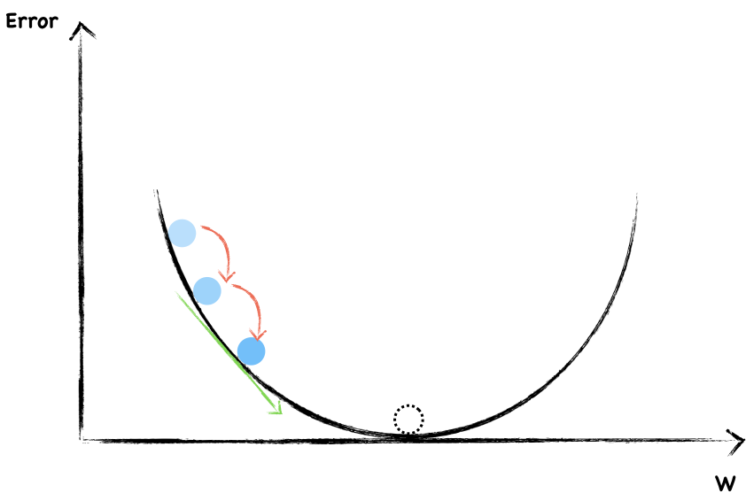

---
redirect_from:
  - "/04/gradientdescent"
interact_link: content/04/GradientDescent.ipynb
kernel_name: python3
has_widgets: false
title: 'Learning to minimize error—Gradient Descent Method'
prev_page:
  url: /04/LossFunction
  title: 'How well does the neural network predict?—Loss Function'
next_page:
  url: 
  title: ''
comment: "***PROGRAMMATICALLY GENERATED, DO NOT EDIT. SEE ORIGINAL FILES IN /content***"
---

# Learning to minimize error: Gradient Descent Method

## Minimize error

The error is a function of the network's weights and biases. We call it loss function which  we introduced last section. The goal of neural network is adjust the weight to minimize the output of loss function.

In last section, we have introduced MAE loss function:

$$L(w, b) = \frac{1}{n}\sum_{i=1}^{n}\left ( y_{i} - t_{i} \right )^2$$

Here, we can calculate $y_i$ with input, weights and biases.

$$y_i = \sigma (w_ix_i+b_i)$$

If I substitute y into this equation:

$$L(w, b) = \frac{1}{n}\sum_{i=1}^{k}\left ( \sigma (w_ix_i+b_i) - t_{i} \right )^2$$

So it's clear that The error is a function of the network's weights and biases.

## What is Gradient Descent?

Let's start with the classic mountaineering example to explain the gradient descent. Suppose you are at the peek of a mountain and need to reach a lake which is in the valley of the mountain. It's on dark nights and you have zero visibility to see where you are headed. The only thing you have is a torch to see a short distance. So, what approach will you take to reach the lake? Take a few minutes to think about this.

You may use the torch to look around the ground beneath your feet. Then you can figure out where it is going downward and take small steps in that direction. In this way, you keep following the path that is descending, step by step, you’re likely to reach the lake at the valley.

>Photo by Matt Lamers on Unsplash

This method in mathematic is called gradient descent. The gradient means the slope of the ground.

What does gradient descent have to do with our neural network? We want to minimize the output error of loss function, hiking down the mountain means minimizing the error!

### Example

Here we still begin with this simple neural network. 

Say the following graph shows a function where $y$ is the error, we are going to find the $w$ to minimize it.

The dotted circle is where error equal to $0$ and that's where we want to be as close as possible.

To start, we randomly choose a value of $w$. The blue dot represent current weight and error. Now, let's look around to see which direction should we go. The slope help us to do that. This is a negative gradient, so we increase the $w$ a little.

Again, this is a negative slope, we continue increase $w$.

Each time, we adjust the weight the same size step by step. In this way, if we're lucky, we're probably arrived at the bottom.

### Avoid Overshooting

However, we are likely to overshooting the minimum and forever bouncing around it.

To avoid overshooting, what should we do?

Well, as you can see, in order not to overshooting through the minimum, we have to take smaller and smaller step towards the end.

You may have notice that the steeper the slope, the larger our step and the flatter the slope, the smaller our step.

On the whole, we randomly choose a weight and then changed it in a direction opposite to the gradient. Besides, as we get close to the local bottom, we change the step size according to how steep the slope is. We can use mathematical expression to express the process of weight updating each time.

If the slope is negative, we increase the weight. Otherwise, we decrease the weight. So use a minus sign when you update. The step size also varies with each change in the slope. Moreover, the learning rate is a factor to control the intensity of updates. 

Congratulations! You have learned how to update weights to minimize errors which is a big step forward.
