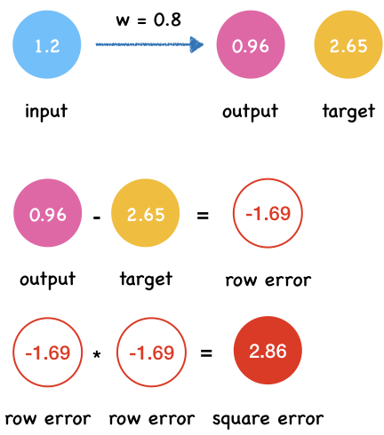
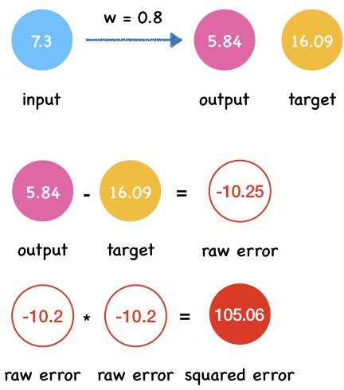

---
redirect_from:
  - "/04/lossfunction"
interact_link: content/04/LossFunction.ipynb
kernel_name: python3
has_widgets: false
title: 'How well does the neural network predict?—Loss Function'
prev_page:
  url: /04/Intro
  title: '4. Training Neural Networks'
next_page:
  url: /04/GradientDescent
  title: 'Learning to minimize error—Gradient Descent Algorithm'
comment: "***PROGRAMMATICALLY GENERATED, DO NOT EDIT. SEE ORIGINAL FILES IN /content***"
---

# How well does the neural network predict: Loss function

Everyone makes mistakes. The wise are not people who never make mistakes, but those who forgive themselves and learn from their mistakes. —— Ajahn Brahm

When you take a math test, the teacher will mark you down for the mistakes you made. Your friend ask you how's your test? You may say: well, not bad. I made two mistakes and deducted 6 points. Then you learn from your mistakes and perform better the next time. The score you get on a test is an indicator.

For neural network, there is such an indicator too. Like human, the neural network make errors. We measure it by compareing the target values and actual value producted by neural network.

Suppose we don't know the direct conversion between pounds and kilograms. We want to learn their relationship from the data through a simple neural network.


Here $x$ is input, $w$ is weight, $y$ is the network's output and $t$ is the target value of the training data.

The table shows four columns of data. What we know now is the input $x$ and the target value of the training data $t$. The neural network will output the $y$ value.

|  input x | target t |
| ---- | ----------------------- |
| 1.2    | 2.65                  |
| 3.4    | 7.50                  |
| 2.8    | 6.17                  |
| 7.3    | 16.09                 |

First, we randomly set the value of $w$ to $0.8$.


{:.input_area}
```python
w = 0.8
def neural_netwok_predict(x, w):
    y = w * x
    return y
```


We define row error as the difference between the actual value $y$ and the target value $t$ .

*row_error = actual_value - target_vlaue*


{:.input_area}
```python
def row_error(y, t):
    return y - t
```


And the squared error by calculating the square of the row error.

*squared_error = row_error * row_error*


{:.input_area}
```python
def squared_error(y, t):
    error = row_error(y, t)
    return error**2
```


{:.input_area}
```python
def predict_and_get_error(x, t):
    y = neural_netwok_predict(x, w)
    print("Output y: {}".format(y))

    error = squared_error(y,t)
    print("Squared error e: {}".format(error))
```


Let's calculate the output $y$, row error and squared error one by one.


{:.input_area}
```python
x = 1.2
t = 2.65
predict_and_get_error(x, t)
```


{:.output .output_stream}
```
Output y: 0.96
Squared error e: 2.8560999999999996

```




{:.input_area}
```python
x = 3.4
t = 7.50
predict_and_get_error(x, t)
```


{:.output .output_stream}
```
Output y: 2.72
Squared error e: 22.848399999999994

```


{:.input_area}
```python
x = 2.8
t = 6.17
predict_and_get_error(x, t)
```


{:.output .output_stream}
```
Output y: 2.2399999999999998
Squared error e: 15.4449

```


{:.input_area}
```python
x = 7.3
t = 16.09
predict_and_get_error(x, t)
```


{:.output .output_stream}
```
Output y: 5.84
Squared error e: 105.0625

```



## Loss function: Mean Squared Error

Now we get all the output y and square errors.

|  x | t | y | e|
| ---- | ----------------------- | ---------|---------|
| 1.2    | 2.65                  |  0.96                |2.8561|
| 3.4    | 7.50                  |  2.72               |22.8484|
| 2.8    | 6.17                  |  2.24               |15.4449|
| 7.3    | 16.09                 |  5.84              |105.0625|

By adding up the errors in each data and average them, we get the Mean Square Error(MSE).


{:.input_area}
```python
def mean_square_error(errors):
    MAE = 1/len(errors) * sum(errors)
    return MAE
```


{:.input_area}
```python
errors = [2.8561,  22.8484,  15.4449, 105.0625]
mean_square_error(errors)
```


{:.output .output_data_text}
```
36.552975
```


When the weight is 0.8, the MAE is around 36.55.

**In this way, we can calculate the MSE every time we change the value of the weight. The smaller the value of MSE, the better the prediction effect of neural network.**

The form of mathematical expressions of MAE:

$$L = \frac{1}{n}\sum_{i=1}^{n}\left ( y_{i} - t_{i} \right )^2$$

Here MAE is a **loss function** (or cost function). There are many other functions can be used as loss function.

As you can see, the positive and negative errors cancel each other out. So the total error become 0 which suggest the neural network makes no mistakes. However, that's not true.

## Why we use squared error instead of raw error?

Suppose we have a set of data.

| Node | Actual value by network | Target training values |
| ---- | ----------------------- | ---------------------- |
| 1    | 0.6                     | 0.5                    |
| 2    | 0.6                     | 0.7                    |
| 3    | 0.7                     | 0.85                   |
| 4    | 0.95                    | 0.8                    |

The first thing that comes to mind is to use row error to measure the performance of neural network.


$$L = \sum_{i=1}^{n}\left ( y_{i} - t_{i} \right )$$


Here, $n$ is the number of output nodes. $y_{i}$ is the output value of neural network and $t_{i}​$ is the target training value.


For those data, the calculated error result is


| Node | Actual value by network | Target training values | Error |
| ---- | ----------------------- | ---------------------- | ----- |
| 1    | 0.6                     | 0.5                    | 0.1   |
| 2    | 0.6                     | 0.7                    | -0.1  |
| 3    | 0.7                     | 0.85                   | -0.15 |
| 4    | 0.95                    | 0.8                    | 0.15  |


And then we sum them up:

$$L = 0.1 + (-0.1) + (-0.15) + (0.15)$$

$$L = 0$$


As you can see, the positive and negative errors cancel each other out. So the total error become 0 which suggest the neural network makes no mistakes which is not true. However, this can be solved in MSE.
